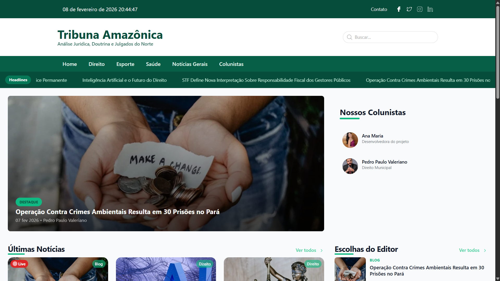

# 📰 Tribuna Amazônica

**Tribuna Amazônica** é uma plataforma de notícias e colunas desenvolvida em **WordPress**, com foco em conteúdo jornalístico amazônico.  
O projeto foi desenvolvido como **trabalho freelancer**, com layout personalizado, componentes reutilizáveis e otimização de performance.

> ⚠️ **Aviso:** Este repositório tem caráter demonstrativo. Todos os direitos do projeto pertencem ao cliente.



---

## 🔗 Acesso ao Site

👉 https://tribunaamazonica.com.br/

---

## 🛠️ Tecnologias Utilizadas

### Backend
- PHP  
- WordPress

### Frontend
- Tailwind CSS  
- JavaScript (ES6+)

### Build & Tooling
- Vite  
- PostCSS  
- npm

---

## ✨ Funcionalidades

- 📱 **Layout Responsivo**  
  Menu mobile animado e controle dinâmico de altura para melhor usabilidade.

- ✍️ **Sistema de Colunistas**  
  Integração nativa com autores do WordPress para gerenciamento de colunas.

- 🗂️ **Páginas Especializadas**  
  Templates dedicados para:
  - Posts
  - Categorias
  - Colunistas

- 📩 **Integração com Newsletter e Instagram**  
  Conexões diretas com plataformas de email marketing e redes sociais na home.

- 🔎 **Filtro por Categorias**  
  Permite aos usuários navegar e filtrar notícias por temas específicos.

- ⚡ **Ícones SVG Inline**  
  Melhor desempenho e carregamento mais rápido das páginas.

- 🧩 **Componentes Reutilizáveis**  
  Estrutura modular para facilitar manutenção e evolução do projeto.

---

## 🚀 Instalação e Uso Local

### Pré-requisitos
- Node.js  
- npm  
- Ambiente WordPress configurado

### Passo a passo

1. **Clone o repositório**
   ```bash
   git clone https://github.com/soouzaana/Tribuna-Amazonica.git
   cd Tribuna-Amazonica

2. **Instale as dependências:**
   ```bash
   npm install
   ```

3. **Compile os ativos:**
   ```bash
   npm run build
   ```

4. **Configure o WordPress:** 
   - Instale o WordPress em seu servidor (recomendado: Hostinger).
   - Ative o tema Tribuna Amazônica através do painel do WordPress.

## 📄 Licença

Este projeto não possui licença open-source.
Seu código está disponível apenas para fins de portfólio e demonstração técnica.

## 📬 Contato

Desenvolvido por **Ana Souza**  
📧 E-mail: [anamariasouza701@gmail.com](mailto:anamariasouza701@gmail.com)  

💼 [Portfólio](https://anamaria-portfolio.netlify.app/)  
🔗 [LinkedIn](https://www.linkedin.com/in/ana-maria-brito-souza-8aba5619a/)  
🐙 [GitHub](https://github.com/soouzaana)
